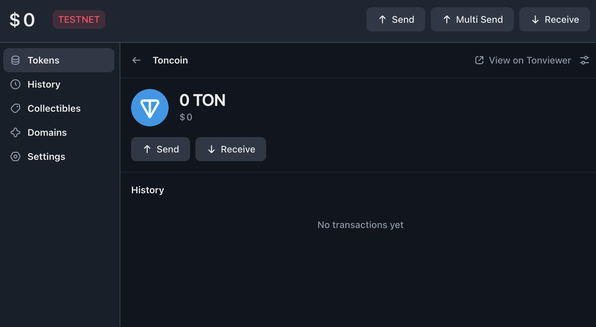
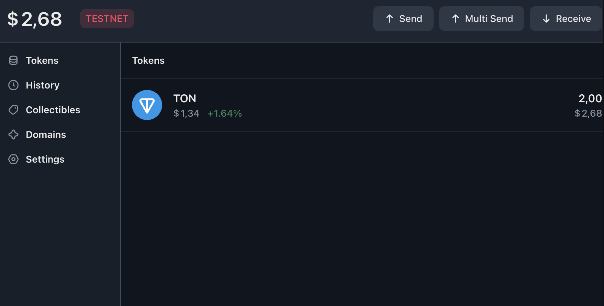
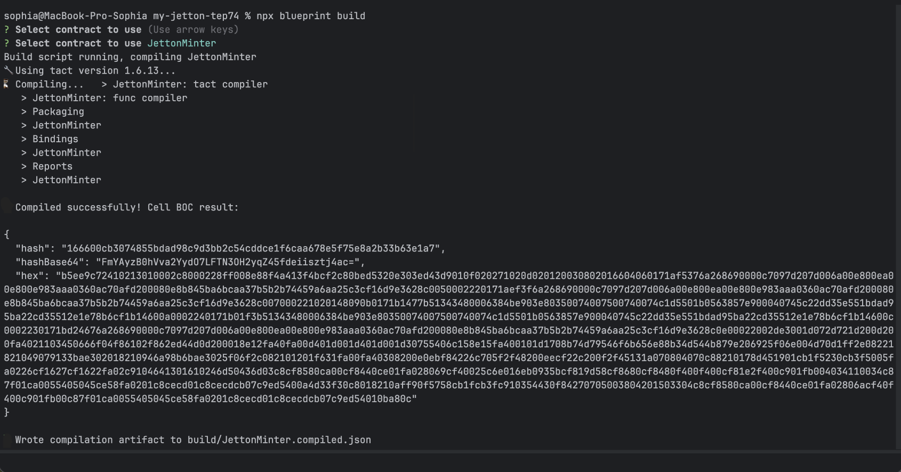
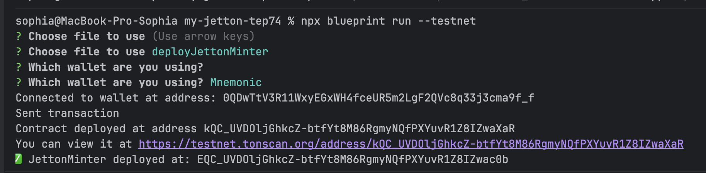
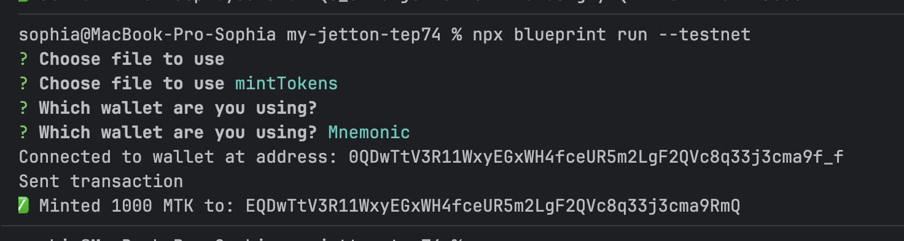

# 

## 👩‍🎓 Состав группы:
Полишкарова Анна M3403
Дудина Вероника M3401
Бровкина София M3402 0QDwTtV3R11WxyEGxWH4fceUR5m2LgF2QVc8q33j3cma9f_f

## 💻 Платформа
ton testnet

## 📝 Краткое описание выполненных шагов
### Создание кошелька и получение тестовых средств
1. Скачали tonkeeper https://tonkeeper.com/?ysclid=mlz6pcj5an887406885
2. Создали кошелек
   
3. Адрес кошелька 0QDwTtV3R11WxyEGxWH4fceUR5m2LgF2QVc8q33j3cma9f_f
4. Получили денкежку через тг-бот @testgiver_ton_bot
   

### 🛠 Подготовка среды разработки
1. Установили Blueprint
2. Создали .env с мнемоникой, добавила .env в .gitignore

### 🖋 Написание смарт-контракта
1. Написали контракт jetton_minter.tact и jetton_wallet.tact
   
2. Написали скрипт для деплоя deployJettonMinter.ts

### 🚀 Развертывание контракта в тестовой сети
1. Задеплоили
   
   [наш testnet tonscan](https://testnet.tonscan.org/address/kQC_UVDOljGhkcZ-btfYt8M86RgmyNQfPXYuvR1Z8IZwaXaR)

### 💰 Эмиссия токенов
1. Написали скрипт на эмиссию mintTokens.ts
   

Перевод коллеге сделан

Исходный код контракта прилагается в файлах contracts/jetton_minter.tact и contracts/jetton_wallet.tact.
npx blueprint verify --testnet
публичный верификатор verifier.ton.org не поддерживает тестовую сеть TON 

